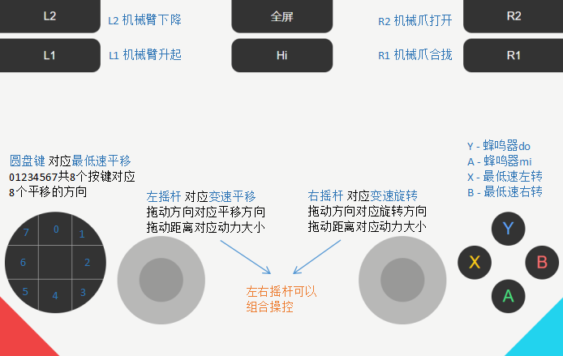

# Control (操控)

> Translated from <https://guidan.com/a3/manual/control/>

Covers operating the A3's Mecanum chassis: gamepad pairing and the button map.

## Gamepad pairing (手柄配对)

The source provides **only a video link** — no written steps.

📹 <https://www.bilibili.com/video/BV1P2421K7Qs/> (Bilibili, Chinese)

**[Not in source]** — written pairing instructions. Not transcribed here.

## Button map (按键说明)

> **蓝牙手柄与虚拟手柄按键同步** — the **Bluetooth gamepad and the virtual (on-screen) gamepad
> are synchronised**: the same button does the same thing on both.



Transcribed from the diagram:

### Shoulder buttons — arm and gripper

| Button | Default action |
|---|---|
| **L1** | Raise the arm (机械臂升起) |
| **L2** | Lower the arm (机械臂下降) |
| **R1** | Close the gripper (机械爪合拢) |
| **R2** | Open the gripper (机械爪打开) |

### Face buttons

| Button | Default action |
|---|---|
| **Y** | Buzzer — note *do* (蜂鸣器do) |
| **A** | Buzzer — note *mi* (蜂鸣器mi) |
| **X** | Turn left at minimum speed (最低速左转) |
| **B** | Turn right at minimum speed (最低速右转) |

### D-pad (圆盘键)

Fixed **minimum-speed translation** (对应最低速平移). The 8 keys `0`–`7` map to the 8 translation
directions:

```
   7   0   1
   6       2
   5   4   3
```

`0` is the top, numbering runs clockwise. This matches the `CROSS_0`…`CROSS_7` handler numbering
in [gamepad-programming.md](gamepad-programming.md).

### Analog sticks

| Stick | Default action |
|---|---|
| **Left stick** (左摇杆) | **Variable-speed translation** (变速平移). Drag *direction* sets the translation direction; drag *distance* sets the power. |
| **Right stick** (右摇杆) | **Variable-speed rotation** (变速旋转). Drag *direction* sets the rotation direction; drag *distance* sets the power. |

> **左右摇杆可以组合操控** — the two sticks **can be combined**, translating and rotating at once.

This mirrors the `move()` API in [python.md](python.md): left stick ≈ `x`/`y` power, right stick
≈ `z` power, and combining them is the same as passing `x`/`y` and `z` together.

### Other on-screen controls

| Control | Meaning |
|---|---|
| **全屏** | Fullscreen |
| **Hi** | **[Not in source]** — labelled but never explained |

## Defaults vs. custom handlers

Everything above is the **default** map. Any of it can be overridden — see
[gamepad-programming.md](gamepad-programming.md). Restoring a button's default is done from its
edit dialog.
