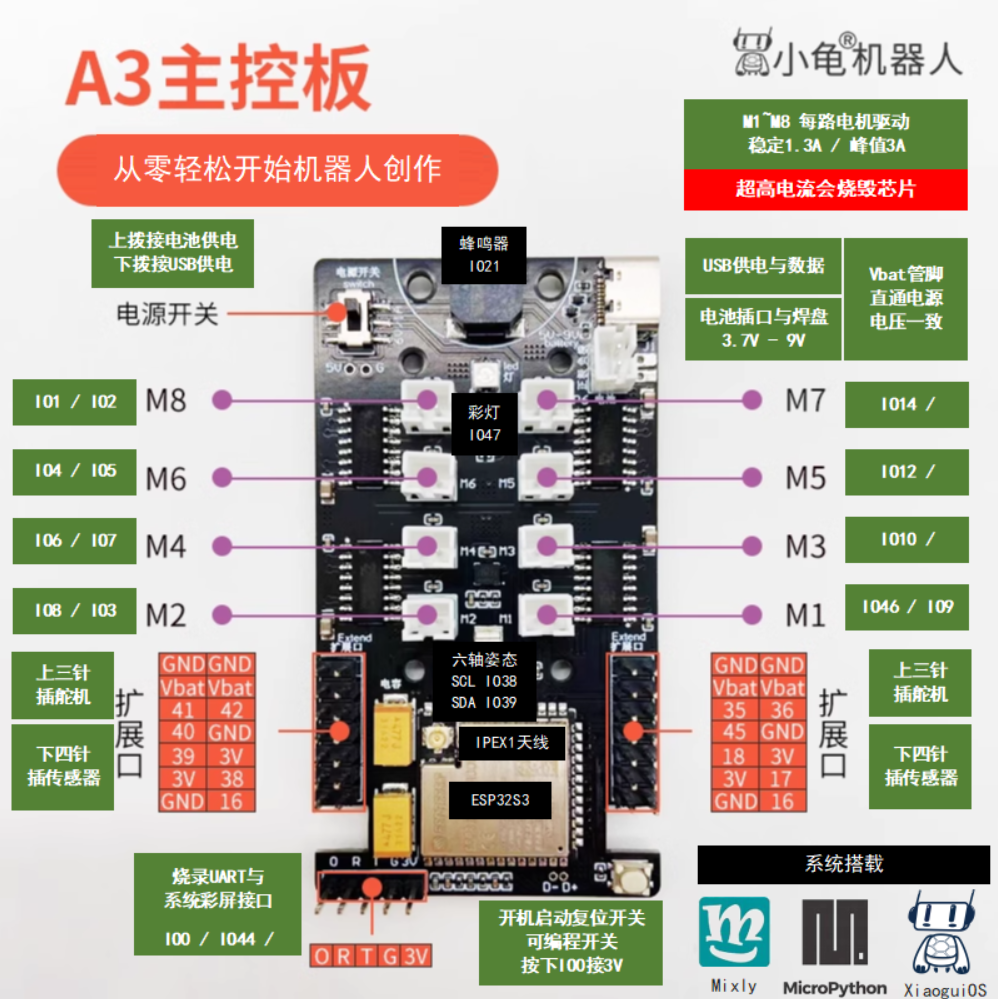

# Pin Reference (管脚说明)

> Translated from <https://guidan.com/a3/manual/pins/>
>
> The upstream page contains **no text at all** — it is a single annotated image
> (`https://guidan.com/a3/assets/a3.png`). Everything below is transcribed from that image.

**Board:** A3 主控板 (A3 mainboard) — "从零轻松开始机器人创作" ("start creating robots easily from
zero"). MCU: **ESP32-S3**, with an **IPEX1 antenna** connector.

**Preinstalled systems (系统搭载):** Mixly · MicroPython · XiaoguiOS

## Motor outputs

Eight motor channels, M1–M8. Each is a pin pair.

| Motor | Pins | Notes |
|---|---|---|
| M1 | IO46 / IO9 | |
| M2 | IO8 / IO3 | |
| M3 | IO10 / **?** | **[Not in source]** — second pin absent |
| M4 | IO6 / IO7 | |
| M5 | IO12 / **?** | **[Not in source]** — second pin absent |
| M6 | IO4 / IO5 | |
| M7 | IO14 / **?** | **[Not in source]** — second pin absent |
| M8 | IO1 / IO2 | |

> **The M3/M5/M7 gaps are real.** The source image literally prints `IO10 /`, `IO12 /`, `IO14 /`
> with nothing after the slash. This was confirmed by zooming into the original PNG at full
> resolution — it is not a download or rendering artifact, it is a defect in the vendor's diagram.
> Do **not** assume the missing pins are IO11/IO13/IO15 by pattern; M2 (`IO8 / IO3`) and M1
> (`IO46 / IO9`) show the pairs are not sequential. Read them off the hardware.

### Motor drive limits — read before wiring

> **M1~M8 每路电机驱动: 稳定 1.3A, 峰值 3A**
> Each motor channel: **1.3A continuous, 3A peak.**
>
> **超高电流会烧毁芯片 — Excessive current will burn out the chip.**

This warning is printed in red in the source. Treat 1.3A continuous as the real budget.

## Onboard peripherals

| Peripheral | Pins |
|---|---|
| Buzzer (蜂鸣器) | IO21 |
| RGB LED (彩灯) | IO47 |
| 6-axis IMU (六轴姿态) | SCL = IO38, SDA = IO39 |

## Power

| Item | Detail |
|---|---|
| Power switch (电源开关) | **Up** = battery power (上拨接电池供电) · **Down** = USB power (下拨接USB供电) |
| USB port | Power **and** data (USB供电与数据) |
| Battery connector & pads (电池插口与焊盘) | **3.7V – 9V** |
| Vbat pin | Tied directly to the supply — same voltage as the input (Vbat管脚直通电源电压一致) |

Because Vbat is a direct pass-through, anything on a Vbat pin sees the raw battery voltage
(up to 9V), not a regulated rail. Servos plugged into the extension ports are powered from Vbat.

## Boot / reset switch

> **开机启动复位开关 · 可编程开关 · 按下IO0接3V**
> Boot/reset switch. Also a programmable switch. **Pressing it connects IO0 to 3V.**

Transcribed as printed. Note this is the opposite of the usual ESP32 convention, where the boot
button pulls IO0 to **GND**. The diagram says 3V. Verify before relying on it.

## UART / display header

Labelled **烧录UART与系统彩屏接口** — "flashing UART and system colour-screen interface".

Silkscreen, left to right: `O` `R` `T` `G` `3V`

The annotation box reads `IO0 / IO44 / ` — **[Not in source]**, the third value is absent, same
defect as the motor labels.

| Silkscreen | Meaning | Pin |
|---|---|---|
| `O` | IO0 | IO0 |
| `R` | UART RX | IO44 |
| `T` | UART TX | **[Not in source]** |
| `G` | GND | — |
| `3V` | 3.3V | — |

> On a stock ESP32-S3, U0TXD is IO43 and U0RXD is IO44. Since `R` = IO44 matches, `T` = IO43 is the
> obvious candidate — but **[Inferred]**, the diagram does not print it.

## Extension ports (扩展口)

Two extension ports, one on each side of the board. Each port is two columns of 7 pins. Both ports
carry the same annotation:

- **上三针插舵机** — the **top 3 pins** take a **servo**.
- **下四针插传感器** — the **bottom 4 pins** take a **sensor**.

Transcribed exactly as laid out in the diagram (rows top to bottom):

### Left extension port

| Col A | Col B |
|---|---|
| GND | GND |
| Vbat | Vbat |
| 41 | 42 |
| 40 | GND |
| 39 | 3V |
| 3V | 38 |
| GND | 16 |

### Right extension port

| Col A | Col B |
|---|---|
| GND | GND |
| Vbat | Vbat |
| 35 | 36 |
| 45 | GND |
| 18 | 3V |
| 3V | 17 |
| GND | 16 |

### Reading these tables

Taking each column as one 7-pin connector, top 3 = servo, bottom 4 = sensor:

| Port / column | Servo (top 3) | Sensor (bottom 4) |
|---|---|---|
| Left A | GND, Vbat, **IO41** | IO40, IO39, 3V, GND |
| Left B | GND, Vbat, **IO42** | GND, 3V, IO38, IO16 |
| Right A | GND, Vbat, **IO35** | IO45, IO18, 3V, GND |
| Right B | GND, Vbat, **IO36** | GND, 3V, IO17, IO16 |

**[Inferred]** — this split follows the 上三针/下四针 annotation, but the source never labels the
individual rows, so the grouping is a reading of the layout, not a stated fact.

Two things worth flagging:

- **IO16 is printed on both ports** (bottom row, column B, left *and* right). Either the two ports
  share IO16, or one label is a typo in the source. Unresolved — transcribed as printed.
- **The left port exposes IO38 and IO39, which are the IMU's I²C pins** (SCL/SDA). So the left port
  is very likely a shared I²C bus rather than free GPIO. **[Inferred]** — but the pin numbers are
  printed in both places in the source, so the overlap itself is a fact. Expect a conflict if you
  drive IO38/IO39 as plain GPIO while using the IMU.

### Cross-check against the Python docs

The ultrasonic example in [python.md](python.md) uses `car.hcsr04(16, 17)` — trig 16, echo 17.
IO17 and IO16 are exactly the bottom two sensor pins of the **right port, column B**. So that
example is wired to the right-hand sensor port, which corroborates the sensor-pin reading above.
