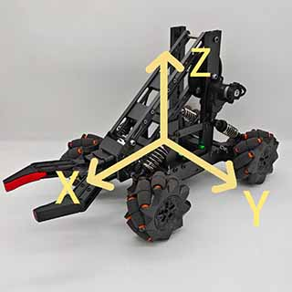

# Python Programming

> Translated from <https://guidan.com/a3/manual/python/>

Motion of the Mecanum-wheel chassis is controlled by combining three components: forward/backward
power, left/right power, and rotational power. The vendor has unified the control interface into a
single function — you only need to remember one function. Examples follow.

## Coordinate system



The body coordinate frame is as shown. The motion control parameters are defined relative to it.

- **x axis** — the front/back direction of the body. **Forward is +x.**
- **y axis** — the left/right direction of the body. **Left is +y.**
- **z axis** — the up/down direction of the body. **Up is +z.**

This is a standard right-handed frame, so +z rotation is counter-clockwise seen from above.

## Motion control interface

### Chassis motion function

```python
move(x=0, y=0, z=0, T=1)
```

| Param | Meaning | Range |
|---|---|---|
| `x` | Translation power along the x axis, as a percentage. | -100 – 100 |
| `y` | Translation power along the y axis, as a percentage. | -100 – 100 |
| `z` | Rotation power about the z axis, as a percentage. | -100 – 100 |
| `T` | Dual meaning — see below. | see below |

**`T` behaves differently depending on the motion type. This is the one real subtlety in the API:**

- **When the motion is a translation**, `T` is a **duration in seconds**.
  - `T >= 0` — the chassis stops after `T` seconds.
  - `T < 0` — the chassis **keeps moving indefinitely**. You must stop it yourself.
- **When the motion is a rotation or a pivot-around-a-post (绕桩)**, `T` is a **rotation angle in
  degrees**. The chassis stops once it has turned that far.

### Chassis stop function

```python
stop()
```

## Basic motion examples

### Forward / backward translation (前后平移)

Needs only x power. `x > 0` moves forward, `x < 0` moves backward.

```python
move(80)         # Translate forward for 1 second at 80% power.
move(-80)        # Translate backward for 1 second at 80% power.
move(80, T=2)    # Translate forward for 2 seconds at 80% power.
```

### Left / right translation (左右平移)

Needs only y power. `y > 0` moves left, `y < 0` moves right.

```python
move(y=100)         # Translate left for 1 second at 100% power.
move(y=-100)        # Translate right for 1 second at 100% power.
move(y=100, T=2)    # Translate left for 2 seconds at 100% power.
```

### Rotation (旋转)

Needs only z rotation power. `z > 0` rotates counter-clockwise, `z < 0` rotates clockwise.

Note `T` is now **degrees**, not seconds.

```python
move(z=80, T=90)     # Rotate 90° counter-clockwise at 80% power.
move(z=-80, T=90)    # Rotate 90° clockwise at 80% power.
```

## Combined motion examples

### Diagonal translation (斜向平移)

Needs x power and y power together.

```python
move(20, 100)      # Translate forward-left for 1s. x power 20%, y power 100%.
move(20, -100)     # Translate forward-right for 1s. x power 20%, y power 100%.
move(-20, 100)     # Translate backward-left for 1s. x power 20%, y power 100%.
move(-20, -100)    # Translate backward-right for 1s. x power 20%, y power 100%.
```

> Comments reproduced as written. The source says "y power 100%" on all four lines even where the
> argument is `-100`; it means magnitude. Sign determines direction.

### Turning while driving (边前进(后退)边转弯)

Needs x power and z rotation power together.

```python
move(60, z=15)      # Drive forward while turning left, for 1 second.
move(60, z=-15)     # Drive forward while turning right, for 1 second.
move(-60, z=-15)    # Drive backward while turning left, for 1 second.
move(-60, z=15)     # Drive backward while turning right, for 1 second.
```

> **Careful:** `T` here is seconds (1s default), not degrees — despite `z` being non-zero. Only the
> pure-rotation and pivot cases treat `T` as an angle. The source is not explicit about where the
> boundary lies; these examples are the only evidence. See "Ambiguity in `T`" below.

### Pivoting around a post (绕桩)

Needs y power and z rotation power together. `T` is the arc angle in degrees.

```python
move(y=100, z=-5, T=90)     # Pivot 90° clockwise with the nose pointing at the centre.
move(y=-100, z=5, T=90)     # Pivot 90° counter-clockwise with the nose pointing at the centre.
move(y=100, z=5, T=90)      # Pivot 90° counter-clockwise with the tail pointing at the centre.
move(y=-100, z=-5, T=90)    # Pivot 90° clockwise with the tail pointing at the centre.
```

The sign pairing of `y` and `z` selects which end of the robot faces the centre of the circle:
opposite signs point the nose inward, matching signs point the tail inward.

## Continuous motion examples

Pass `T=-1` to run indefinitely, then stop explicitly.

```python
move(x=60, T=-1)    # Keep moving forward at 60% power.
sleep(1)            # Wait 1 second.
stop()              # Stop.
```

Drive forward, stop when an obstacle is detected:

```python
'''往前开 检测到障碍物停下'''   # Drive forward, stop when an obstacle is detected
move(x=50, T=-1)    # Keep moving forward at 50% power.
while True:
    d = car.hcsr04(16, 17)    # Ultrasonic sensor distance reading. trig=16, echo=17
    if d < 30: break
stop()
```

## Caveats for development

These are gaps and hazards in the upstream page, not part of the translation.

**`car.hcsr04()` is undocumented.** It appears only in this example. The manual never introduces
the `car` object, shows an import for it, or lists its other methods. `sleep()` is likewise used
without an import. **[Not in source]** — where `car` and `sleep` come from. Presumably the runtime
injects them into scope, but this is unverified.

**The distance unit is never stated.** `if d < 30` — the manual says "30" with no unit. HC-SR04
drivers conventionally return centimetres, so 30cm is the likely intent. **[Inferred]** — treat as
unverified.

**Ambiguity in `T`.** The rule "translation → seconds, rotation → degrees" does not cleanly cover
`move(60, z=15)`, which mixes translation and rotation yet is documented as lasting 1 second. The
practical reading is that `T` means degrees only when `x == 0` (pure rotation, or the `y`+`z` pivot
case), and seconds whenever `x != 0`. **[Inferred]** — the source never states this. Verify against
hardware before relying on it, because getting it wrong means a command runs for the wrong duration.

**No API beyond `move()` / `stop()`.** Nothing documented for the buzzer (IO21), RGB LED (IO47),
6-axis IMU (IO38/IO39), or servos, even though the board exposes all of them. See [pins.md](pins.md).
